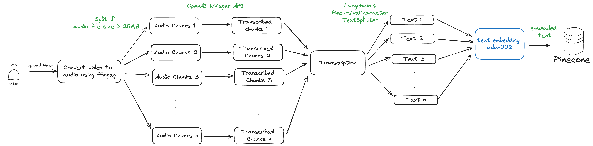
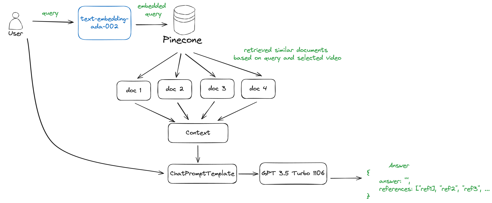

# Chat With Video

This repository contains a Streamlit application that allows users to interact with video content through a chat interface. The application uses OpenAI's Whisper model for transcribing audio from videos and LangChain for creating a conversational AI. Users can upload videos, which are then processed and transcribed. Once transcribed, users can select these videos and ask questions about their content. The key features of the application include:

- **Chat With Video:** Users can select transcribed videos and ask questions to get insights based on the video content.
- **Upload Video:** Users can upload new videos for processing and transcription, making them available for the chat functionality.

## Installation

1. Clone the repository

```bash
git clone git@github.com:ojasskapre/langchain-apps.git
cd langchain-apps/chat-with-video
```

2. Create a virtual environment and activate it

```bash
python -m venv env
source env/bin/activate
```

3. Install required dependencies

```bash
pip install -r requirements.txt
```

4. Setup environment variables for OpenAI API key, LangSmith key and Pinecone key

```bash
cp .env.example .env
# Edit the .env file to include your OpenAI API key and LangSmith key
```

## Usage

Run the streamlit app

```bash
streamlit run Home.py
```

## Demo

[Watch the Demo Here](https://youtu.be/jAmMG8sjI5c)

[Langsmith Trace](https://smith.langchain.com/public/966249c8-086b-47c7-9d34-71db94517ccc/r)

## Process Overview

Video Processing Overview


QA Process Overview


Here’s an overview of the process:

1. **Video Upload and Audio Extraction:**

- Users upload a video file.
- The application uses the ffmpeg-python library to extract audio from the uploaded video.

2. **Audio Transcription:**

- The extracted audio is transcribed using the OpenAI Whisper API.
- Since Whisper has a 25 MB limit for audio files, larger audio files are split into smaller chunks using ffmpeg-python.
- Each chunk is transcribed individually, and the transcriptions are merged to form the complete transcription for the video.

3. **Creating Embeddings:**

- The transcriptions are split into smaller chunks using LangChain’s RecursiveCharacterTextSplitter with a chunk size of 1000 and a chunk overlap of 100. Splitting the transcription into chunks improves the accuracy and efficiency of information retrieval.
- Each chunk is converted into embeddings using OpenAI's text-embedding-ada-002 model.
- The embeddings are stored in a Pinecone vector database along with the video name as metadata.

4. **Chatting with the Video:**

- Users can select one or more videos for querying.
- The application uses the Pinecone vector store as a retriever, filtering documents based on the selected videos.
- A custom ChatPromptTemplate and a QAChain are created, which take the context and user query, and pass them to the prompt.
- The prompt uses the OpenAI GPT-3.5 model to generate a response in JSON format: {answer: "", references: ["", "", ...]}.
- The response is parsed using a JSON output parser.

## References

- [OpenAI Whisper API](https://platform.openai.com/docs/guides/speech-to-text)
- [Langchain Question Answering](https://python.langchain.com/v0.1/docs/use_cases/question_answering/quickstart/)
- [Langchain Pinecone](https://python.langchain.com/v0.1/docs/integrations/vectorstores/pinecone/)
- [Langchain JsonOutputParser](https://python.langchain.com/v0.1/docs/modules/model_io/output_parsers/types/json/)
- [Streamlit Chat UI](https://docs.streamlit.io/develop/tutorials/llms/build-conversational-apps)
- [Streamlit Multi Page UI](https://docs.streamlit.io/get-started/tutorials/create-a-multipage-app)
