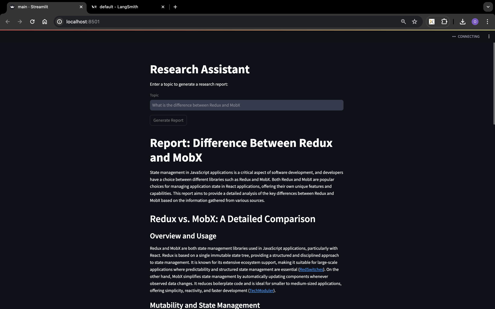
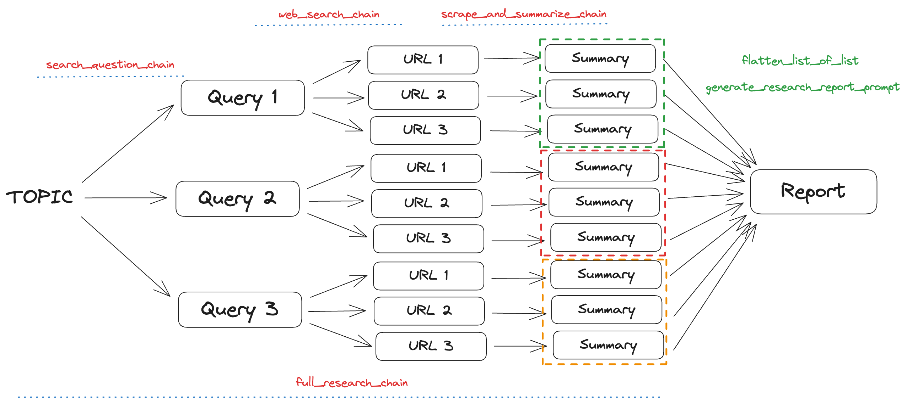

# Research Assistant

This project aims to create a research assistant using LangChain and OpenAI's GPT-3.5 model. The assistant can generate comprehensive research reports based on user-provided topics. The system utilizes web scraping, text summarization, and search query generation to gather and analyze information from various online sources.

## Tasks Done

- Web Scraping: Extracts text from webpages to be summarized.
- Text Summarization: Generates concise summaries of the scraped text.
- Search Query Generation: Creates search queries to find relevant information online.
- Research Report Generation: Compiles the gathered information into a detailed, well-structured research report.
- Streamlit Integration: Provides a user-friendly interface for generating and downloading research reports.

## Installation

1. Clone the repository

```bash
git clone git@github.com:ojasskapre/langchain-apps.git
cd langchain-apps/research-assistant
```

2. Create a virtual environment and activate it

```bash
python -m venv env
source env/bin/activate
```

3. Install required dependencies

```bash
pip install -r requirements.txt
```

4. Setup environment variables for OpenAI API key and LangSmith key

```bash
cp .env.example .env
# Edit the .env file to include your OpenAI API key and LangSmith key
```

## Usage

Run the streamlit app

```bash
streamlit run main.py
```

## Demo

[](https://youtu.be/CtzieIgcaIA)

## Chains Explanation

#### Summary Chain

Purpose: To scrape text from a webpage and generate a summary.

```python
scrape_and_summarize_chain = RunnablePassthrough.assign(summary=RunnablePassthrough.assign(
  text=lambda x: scrape_text(x["url"])[:10000]
) | SUMMARY_PROMPT | ChatOpenAI(model="gpt-3.5-turbo-1106") | StrOutputParser()) | (lambda x: f"URL: {x['url']}\n\nSummary: {x['summary']}")
```

Components:

- scrape_text: Function to scrape text from a given URL.
- SUMMARY_PROMPT: Template for summarizing the scraped text.
- ChatOpenAI: OpenAI's GPT-3.5 model to generate summaries.
- StrOutputParser: Parses the output string.

Workflow:

- Scrape Text: Extracts text from the URL using scrape_text.
- Summarize Text: Feeds the text to the SUMMARY_PROMPT, which generates a prompt for summarization.
- Generate Summary: Uses the GPT-3.5 model to generate a summary.
- Parse Output: Parses the summary into a structured format.

#### Web Search Chain

Purpose: To search the web for URLs related to a given question and

```python
web_search_chain = RunnablePassthrough.assign(
  urls=lambda x: web_search(x["question"])
) | (lambda x: [{"question": x["question"], "url": url} for url in x["urls"]]) | scrape_and_summarize_chain.map()
```

Components:

- web_search: Function to perform a web search and return URLs.
- scrape_and_summarize_chain: Chain to scrape and summarize the content from URLs.

Workflow:

- Search Web: Uses web_search to find URLs relevant to the input question.
- Prepare Data: Prepares a list of dictionaries containing the question and each URL.
- Scrape and Summarize: Uses scrape_and_summarize_chain to scrape and summarize each URL.

#### Search Question Chain

Purpose: To generate search queries for a given task.

```python
search_question_chain = SEARCH_PROMPT | ChatOpenAI(model="gpt-3.5-turbo-1106", temperature=0) | StrOutputParser() | json.loads
```

Components:

- generate_search_queries_prompt: Template to generate search queries.
- SEARCH_PROMPT: Prompt template for generating search queries.
- ChatOpenAI: OpenAI's GPT-3.5 model to generate search queries.
- StrOutputParser: Parses the output string into JSON format.

Workflow:

- Generate Queries: Uses SEARCH_PROMPT and GPT-3.5 to generate search queries.
- Parse Output: Parses the generated queries into a list.

#### Full Research Chain

Purpose: To combine search query generation and web search chains to gather comprehensive information on a given topic.

```python
full_research_chain = search_question_chain | (lambda x: [{"question": q} for q in x]) | web_search_chain.map()
```

Components:

- search_question_chain: Chain to generate search queries.
- web_search_chain: Chain to search the web and summarize content.

Workflow:

- Generate Queries: Uses search_question_chain to generate search queries for the input question.
- Search and Summarize: Uses web_search_chain to search the web and summarize content for each query.

#### Report Generation Chain

Purpose: To generate a detailed research report based on the gathered information.

```python
chain = RunnablePassthrough.assign(
  context = full_research_chain | flatten_list_of_list
) | prompt | ChatOpenAI(model="gpt-3.5-turbo-1106") | StrOutputParser()
```

Components:

- WRITER_SYSTEM_PROMPT: System prompt to instruct the AI on writing style and requirements.
- RESEARCH_REPORT_PROMPT: Prompt to generate the research report.
- ChatPromptTemplate: Template to structure the prompts.
- ChatOpenAI: OpenAI's GPT-3.5 model to generate the report.
- StrOutputParser: Parses the output string into structured format.

Workflow:

- Prepare Context: Combines the results of full_research_chain into a single context.
- Generate Report: Uses the combined context and ChatOpenAI to generate a detailed research report.
- Parse Output: Parses the generated report into a structured format.

### Basic Workflow

1. User Input: The user inputs a topic or question via the Streamlit interface.
2. Generate Search Queries: search_question_chain generates search queries related to the topic.
3. Web Search and Summarize: full_research_chain performs web searches based on the generated queries and summarizes the results.
4. Generate Report: The chain generates a comprehensive research report based on the summarized information.
5. Display and Download: The generated report is displayed to the user, who can download it as a PDF.



## References

- [Youtube Link](https://youtu.be/DjuXACWYkkU?si=_v1Yz0R9ygpTopP3)
- [Prompts GitHub Link](https://github.com/assafelovic/gpt-researcher/blob/master/gpt_researcher/master/prompts.py)
